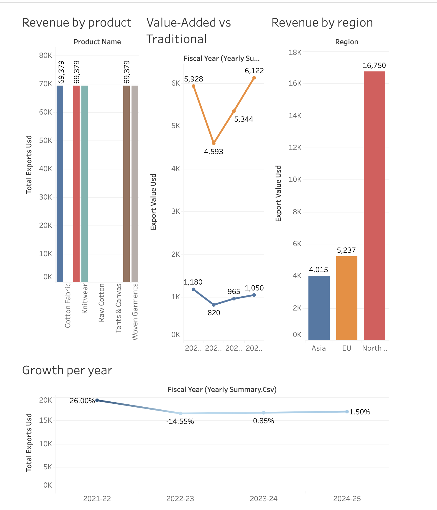

# Pakistan Textile Export Analysis 🇵🇰

## Overview
A data analysis project on Pakistan's textile export industry using real data 
from Pakistan Textile Council (PTC) and Pakistan Bureau of Statistics (PBS).

## Why This Project
I chose this data to work on something real so that I can have hands-on practice 
with real industry data, which can ultimately sharpen my analysis skills.
Just a junior willing to explore, learn, and improve.

## Key Insight
This dashboard shows how floods and COVID-19 impacted Pakistan's textile industry 
and the very gradual recovery that followed. North America remains the dominant 
export destination, and value-added products consistently outperform traditional 
textiles — showing where Pakistan's real opportunity lies.

## Tools Used
- MySQL — database design and querying
- Tableau — data visualization and dashboard

## Dashboard

## ER Diagram

## Database Schema
- `products` — textile product categories with HS chapter codes
- `countries` — export destination countries and regions
- `exports` — quarterly export values and volumes (2021-2025)
- `yearly_summary` — annual totals, YoY growth, cotton production, energy costs

## Data Source
- [Pakistan Textile Council](https://ptc.org.pk)
- [Pakistan Bureau of Statistics](https://pbs.gov.pk)
